# Ritu (ऋतु) - Menstrual Health for Rural Nepal
**Empowering health literacy and cycle tracking for adolescent girls and women in underserved communities.**

## 🌿 Project Overview
**Ritu (ऋतु)**, meaning both *season* and *menstrual cycle* in Nepali, is a free, offline-first Android application designed specifically for adolescent girls and women in rural Nepal.

Built as a solo community initiative over the last two years, Ritu addresses a critical public health gap: providing accurate menstrual health literacy and cycle tracking to women who lack reliable internet access, live far from healthcare proximity, or face cultural stigmas like *Chhaupadi*.

---

---

## 📸 App Gallery

| | | |
|:---:|:---:|:---:|
| 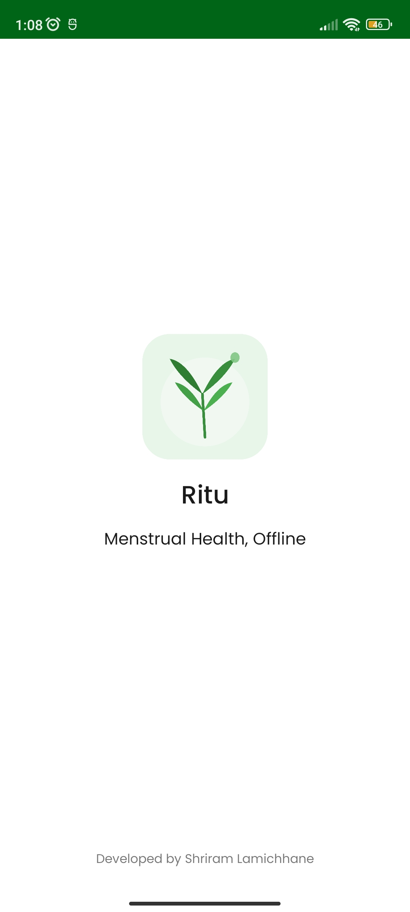 | 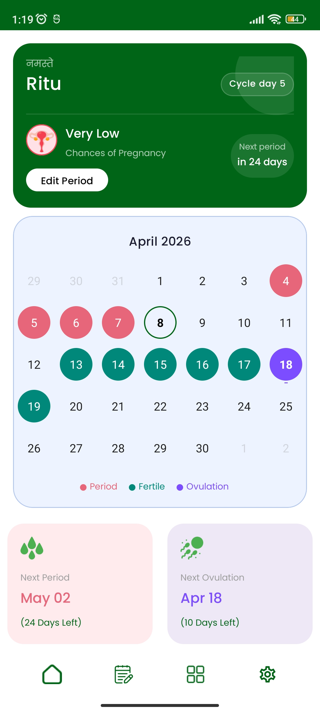 | 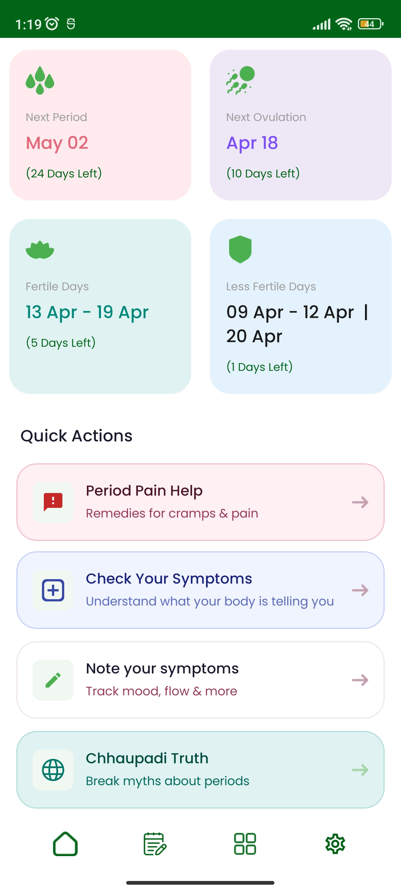 |
| 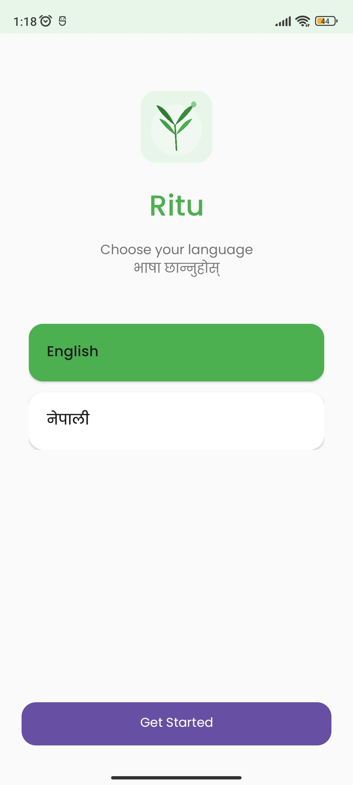 | 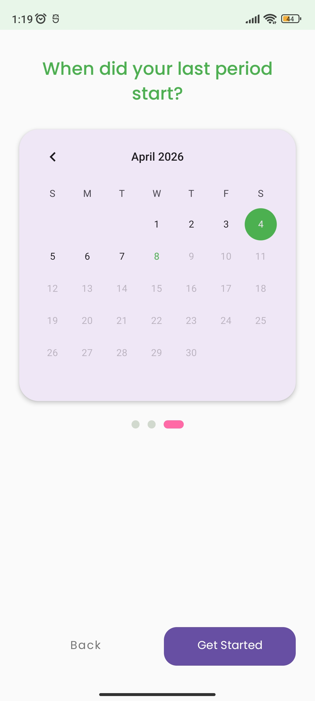 | 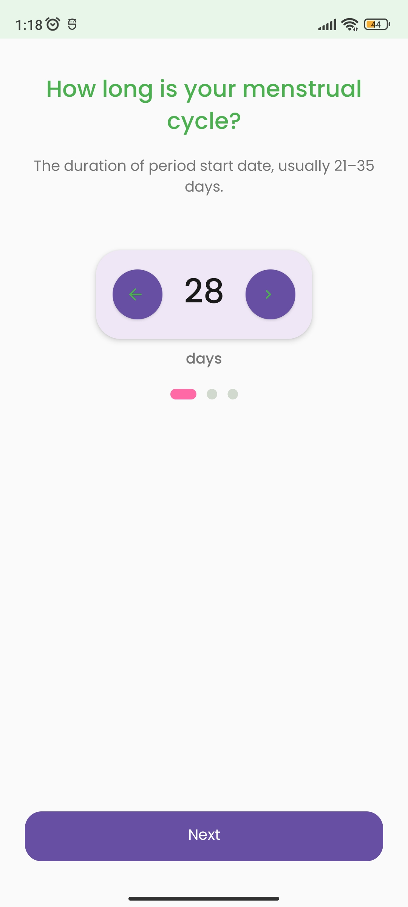 |
| 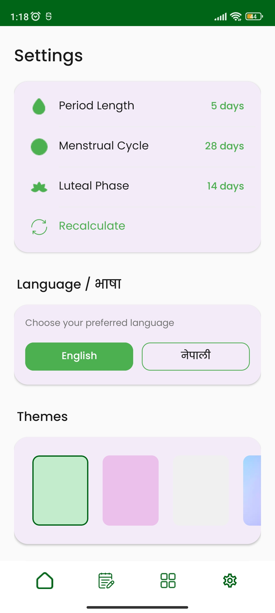 | 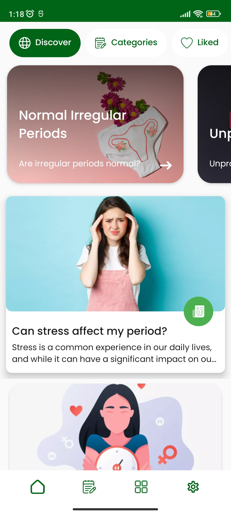 | 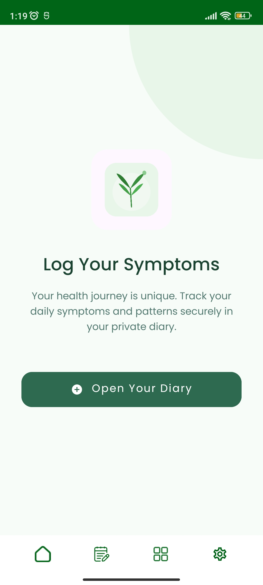 |
| 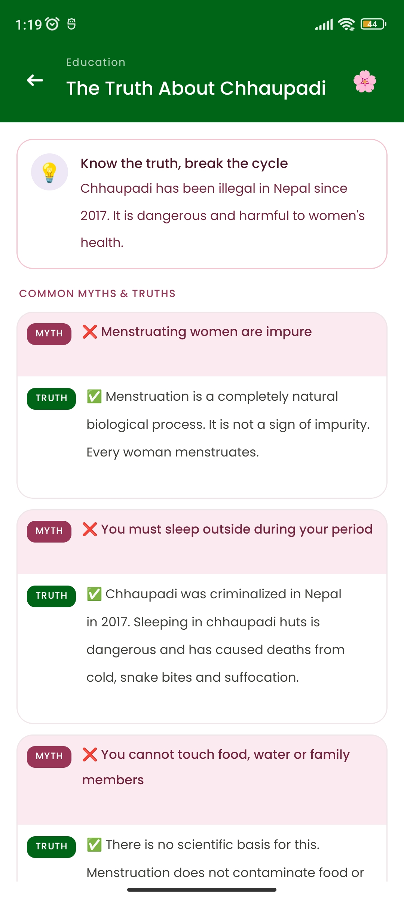 | 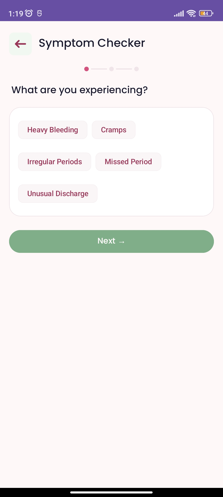 | 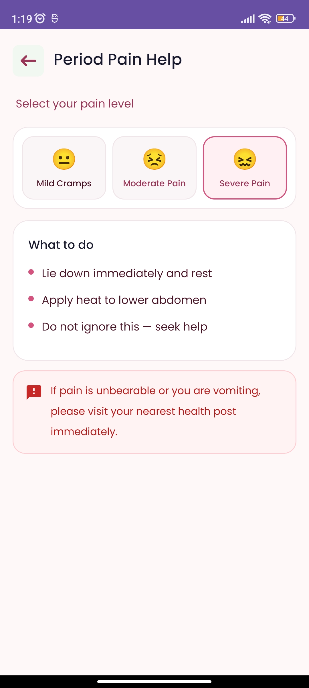 |

---

## 📲 Download & Installation
Since Ritu is a privacy-focused community project, it is distributed directly via GitHub to remain free and accessible.

1.  **[Download the Latest APK here](https://github.com/shrified/ritu/releases/latest)**
2.  Open the `.apk` file on your Android device.
3.  Allow "Installation from Unknown Sources" in your phone settings if prompted.
4.  **Language Switching:** The app features an explicit in-app toggle to switch between **Nepali (नेपाली)** and **English**.

---

## Key Features

### 1. Offline Cycle & Fertility Tracking
* **Accurate Prediction:** Uses clinically validated Naegele’s Rule to predict periods, fertile windows, and ovulation days.
* **Privacy-First:** No cloud dependency. All data is stored locally on the device, ensuring privacy in households where phones are often shared among family members.
* **Bikram Sambat Support:** Development takes into account the Nepali national calendar system used by rural communities.

### 2. Health Education Library (21+ Categories)
* **Bilingual Content:** A curated library of articles available in both English and Nepali, readable entirely offline.
* **Culturally Relevant:** Topics range from hormonal health and cramps to myth-busting content directly addressing the stigma surrounding menstruation in rural provinces.

### 3. Period Pain SOS & Symptom Checker
* **Offline Guidance:** Provides tiered responses to period pain—offering home remedies, dietary advice, and clear "See a Doctor" warning signs.
* **Anonymous Symptom Checker:** An offline decision-tree tool that explains possible causes and home management strategies without requiring internet or registration.

### 4. Inclusive Design Philosophy
* **Low Literacy Friendly:** Uses visual icons and color-coding for intuitive navigation.
* **Offline-First:** No internet required after the initial installation.
* **Free & Ad-Free:** No monetization, no trackers, and no ads—forever.

---

## 🛠 Tech Stack
* **Language:** Kotlin
* **Architecture:** MVVM (Model-View-ViewModel)
* **Local Storage:** SQLite / Shared Preferences
* **UI:** Native Android XML with a focus on high-contrast, accessible design.

---

## 📊 The Impact
Ritu targets the estimated **3.2 million women** in rural Nepal who lack healthcare access. By providing judgment-free, mother-tongue information, the app directly supports **SDG 3 (Good Health and Well-being)** and **SDG 5 (Gender Equality)**.

---

## 🤝 Contributing & Support
This project is a labor of love by **Shriram Lamichhane**. It is open for collaboration with:
* NGOs and Health Workers operating in rural Nepal.
* Educators and Schools.
* Developers interested in health equity technology.

To contribute, please fork the repository and submit a Pull Request. For content suggestions or localizing to specific dialects, please open an Issue.

## 📄 License
This project is licensed under the **MIT License**.

---
*Developed with ❤️ to ensure that health information is a right, not a privilege.*